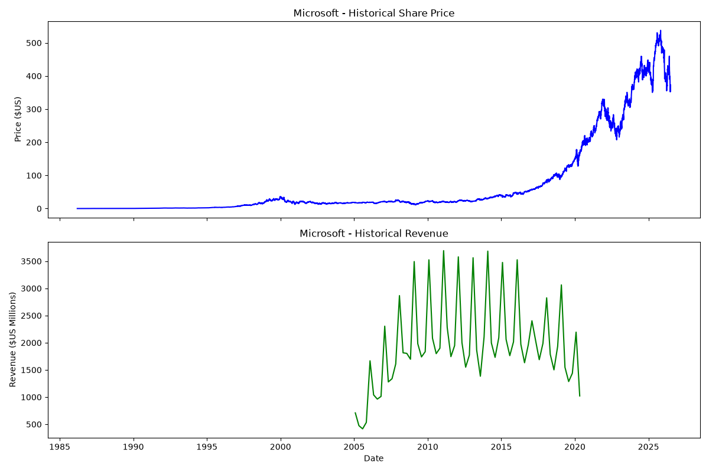

# StockSync-Analysis

StockSync-Analysis is a Python data science pipeline that scrapes fundamental financial data from the web, extracts real-time stock histories, and builds synchronized dual-axis charts to analyze market trends.

## Technical Framework
* **Data Mining Engine:** Automated historical price retrieval using the `yfinance` API matrix.
* **DOM Scraper:** Modular `BeautifulSoup` engine targeting unstructured HTML tabular financial data.
* **Data Cleansing:** Vectorized text manipulation, string stripping, and null handling inside `pandas`.
* **Visualization Dashboard:** Dual-axis plotting using `matplotlib` to contrast asset price velocities with quarterly corporate revenue.

## Operational Insights & Results
This implementation cleanly parses raw web document trees into structured, relational dataframes. By plotting a stock's historical price alongside its quarterly fundamental revenue growth, the script provides a clear, correlated snapshot of market value versus financial reality.

### Sample Output Chart


## Getting Started

### Prerequisites
Ensure you have Python 3.x installed. You can install the required packages using:
```bash
pip install yfinance beautifulsoup4 pandas matplotlib requests
```

### Usage
1. Clone this repository:
   ```bash
   git clone https://github.com
   ```
2. Open and run the Jupyter Notebook `StockSync-Analysis.ipynb` to execute the data pipeline and generate the latest charts.

## 📜 References & Credits
* Original baseline workflow concepts inspired by open-source data science laboratory materials created by the IBM Developer Skills Network.
* Real-time index aggregation handled via open-source Yahoo Finance Python interfaces.
